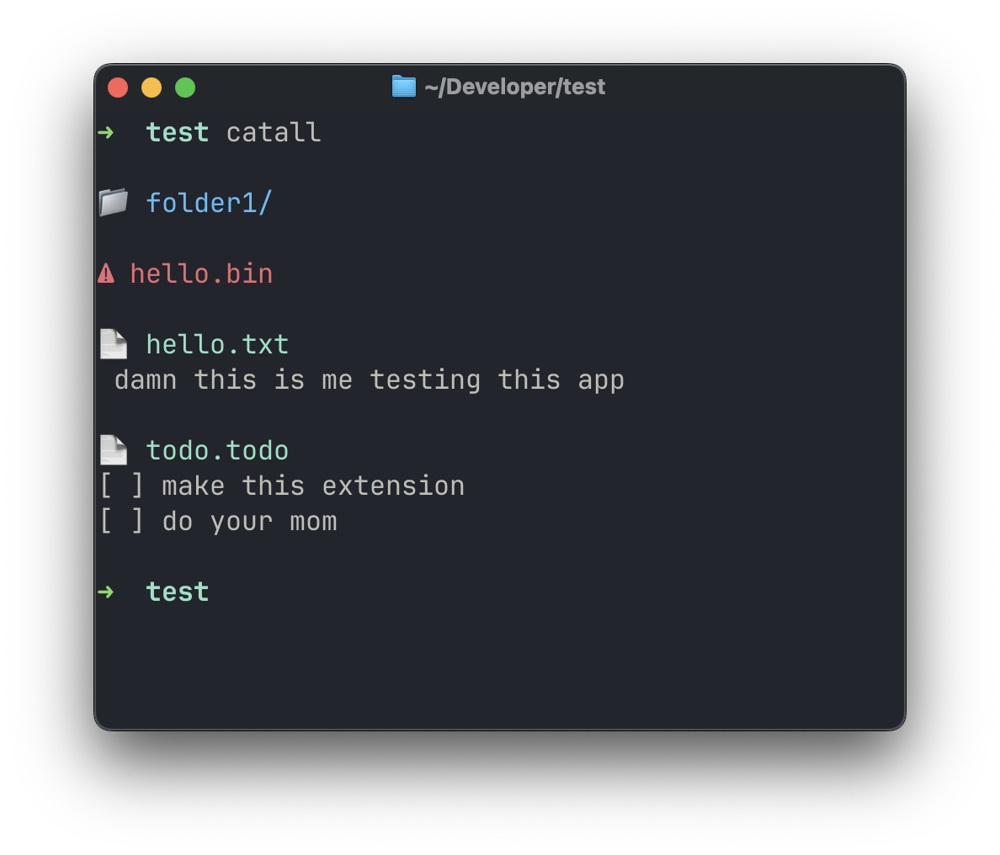

# catall

A minimal terminal command that displays the contents of files in the current directory while keeping folders, documents, images, videos, and binary files visually distinct.



## Features

- Displays folders without entering them
- Displays printable text file contents
- Displays PDFs without dumping their binary contents
- Displays images without dumping their binary contents
- Displays videos without dumping their binary contents
- Displays other binary files without dumping their contents
- `--hidden` flag to include hidden files
- Clean terminal output with color-coded file types
- No recursive traversal
- No dependencies

## File Types

`catall` automatically identifies files using their MIME type.

Images and videos are detected by their MIME type, so common formats such as PNG, JPG, WEBP, GIF, MP4, MKV, MOV, and others are handled automatically.

## Installation

Clone the repository:

```bash
git clone https://github.com/thearkabanerjee/catall.git
cd catall
```

Make the command executable:

```bash
chmod +x catall
```

Move it somewhere in your `PATH`:

```bash
mkdir -p ~/.local/bin
mv catall ~/.local/bin/
```

If `~/.local/bin` is not already in your `PATH`, add it:

```bash
echo 'export PATH="$HOME/.local/bin:$PATH"' >> ~/.zshrc
source ~/.zshrc
```

You can now use `catall` from any directory:

```bash
catall
```

## Usage

Display files and folders in the current directory:

```bash
catall
```

Include hidden files and folders:

```bash
catall --hidden
```

## Requirements

- macOS or Linux
- Bash
- `file` command
- No additional packages or dependencies are required

## Design

`catall` is intentionally simple.

It only operates on the current directory and does not recursively enter folders. Text files are displayed directly, while PDFs, images, videos, and other binary files are identified and displayed without dumping their contents into the terminal.

This keeps the output compact and makes `catall` useful for quickly inspecting a project or directory.

## License
MIT License
